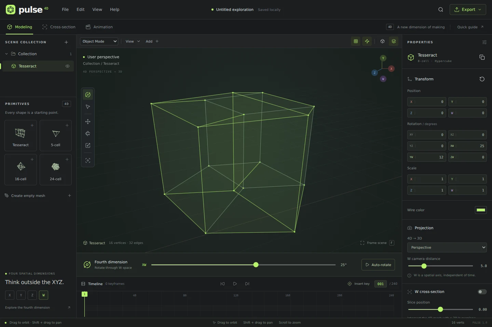

<p align="center"></p>
<h1 align="center">Pulse · 4D Workspace</h1>
<p align="center"><strong>Think outside the XYZ.</strong><br>A browser-native studio for four-dimensional spatial geometry.</p>

Pulse brings a desktop modeling workflow to the fourth spatial dimension. Create polytope meshes, edit their XYZW coordinates, rotate across six planes, inspect three-dimensional cross-sections, and animate transforms in one focused workspace.



## Workspace

- **Real four-dimensional geometry:** every vertex stores X, Y, Z and W. W is a spatial coordinate, not the timeline.
- **Four regular primitives:** tesseract (8-cell), 5-cell, 16-cell and 24-cell with generated vertices, edges and polygon faces.
- **Interactive viewport:** orbit, pan, zoom, frame scene, wireframe and translucent surfaces, visible vertices and floor grid.
- **Modeling tools:** per-axis translation and scale; XY, XZ, YZ, XW, YW and ZW rotation; editable vertex coordinates; connect, delete and extrude selected vertices along W.
- **Scene management:** multiple meshes, object naming, visibility, duplication, colors and undo/redo.
- **Projection:** perspective and orthographic 4D-to-3D projection, adjustable W camera distance.
- **Cross-sections:** intersect polygon faces with a constant-W hyperplane and show the resulting 3D wireframe.
- **Animation:** a 240-frame timeline, transform keyframes, linear interpolation, 24 fps playback and live 4D auto-rotation.
- **Files:** automatic local browser saving, `.pulse4d` project import/export, viewport PNG and projected 3D OBJ export.
- **Focused interface:** original Pulse mark, bundled Lucide icons, keyboard shortcuts, command palette and adaptive panels.

## Run locally

No dependencies or build step are required. Serve the repository through HTTP (ES modules do not work reliably with `file://`):

```sh
python3 -m http.server 4173
```

Open `http://localhost:4173`. `npm start` runs the same server.

## Publish with GitHub Pages

The repository is ready for static hosting, including project subpaths.

1. Open **Settings → Pages** in this repository.
2. Choose **Deploy from a branch**.
3. Select **main** and **/ (root)**, then **Save**.
4. Open the published URL shown by GitHub after deployment finishes.

Everything needed by the application is served from this repository. There are no external runtime scripts, font services, API keys, analytics, accounts or paid services.

## First exploration

1. Drag the **XW** slider beneath the viewport to reveal the tesseract's fourth dimension.
2. Use the rotation fields to explore the other five planes.
3. Open **Cross-section**, reset the object transform, and set the slice to W = 0. The tesseract's central section is a cube.
4. Switch to **Vertex Mode**, click a point and edit its four local coordinates.
5. Shift-click a second vertex to connect them. Extrude a selected edge along W to create a new face.
6. For animation, insert a key at frame 1. Move to a later frame, change the transform, insert another key, and press Play.
7. Export a `.pulse4d` file to keep a portable copy of your work.

## Controls

| Action                            | Control                                      |
| --------------------------------- | -------------------------------------------- |
| Orbit                             | Drag in Orbit tool / Q                       |
| Pan                               | Shift + drag, middle drag, or right drag     |
| Zoom                              | Scroll / two-finger pinch on touchscreens    |
| Select vertices                   | V, then click; Shift + click adds or removes |
| Move object in X/Y                | G, then drag                                 |
| Rotate object in XW/YW            | R, then drag                                 |
| Scale all four axes               | S, then drag                                 |
| Frame scene                       | F                                            |
| Insert transform key              | I                                            |
| Play / pause animation            | Space                                        |
| Duplicate object                  | Shift + D                                    |
| Delete object / selected vertices | Delete / Backspace                           |
| Undo / redo                       | Ctrl/⌘ Z / Ctrl/⌘ Shift Z                    |
| Open / export project             | Ctrl/⌘ O / Ctrl/⌘ S                          |
| Command palette                   | Ctrl/⌘ K                                     |

On narrow screens the primitive library is hidden; use the viewport **Add** menu. Desktop or tablet landscape is recommended for modeling.

## Geometry and data

`src/geometry.js` contains pure geometry, transformation, projection, cross-section and validation functions. `src/renderer.js` projects into a depth-sorted Canvas 2D viewport. `src/app.js` manages editor state, history, keyboard/pointer interaction, local persistence and file workflows.

Rotations are composed in this order: **XY → XZ → YZ → XW → YW → ZW**. Transform order is local scale, rotation, then world translation. Perspective projection uses `xyz × d / (d − w)`; points within 0.15 units of or behind the W camera plane are clipped. The 3D result is viewed through an orbit camera.

A `.pulse4d` document is versioned JSON containing object identities, names, vertices, edges, faces, transforms, colors, visibility and transform keyframes. Imports are validated before replacing the scene. Limits: 8 MB per file, 50 objects, 2,000 vertices per mesh, and a total budget of 10,000 vertices / 30,000 edges / 30,000 faces. Local browser storage is a convenience, not a durable backup; browser data clearing removes it.

## Current scope

This first release is a polytope mesh editor and exploration tool. It does not include sculpting, Boolean solids, cell-level topology editing, materials, physics, skeletal animation or video rendering. Cross-sections render intersection **edges**, not reconstructed solid volumes. Translucent faces use depth sorting rather than a physically accurate renderer. OBJ export contains the complete current **3D projection**, not four-dimensional geometry or the current cross-section. Use `.pulse4d` to preserve the fourth coordinate and animation.

## Verification

```sh
npm test
```

Node.js 22+ runs the tests without installing packages. Tests cover primitive topology, uniform edge lengths, norm-preserving 4D rotations, the tesseract's central cubic section, projection clipping, keyframe interpolation and malformed project rejection. GitHub Actions runs these checks on pushes and pull requests.

## Icon attribution

Interface icons are bundled from [Lucide](https://lucide.dev), under the ISC license in `assets/LUCIDE-LICENSE`. The Pulse mark and application interface are original to this project.
